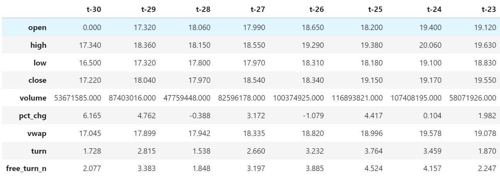
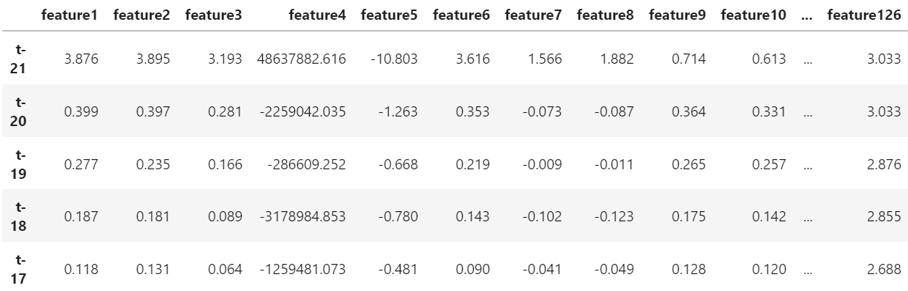
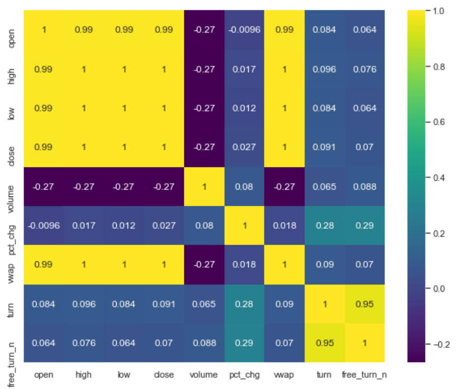
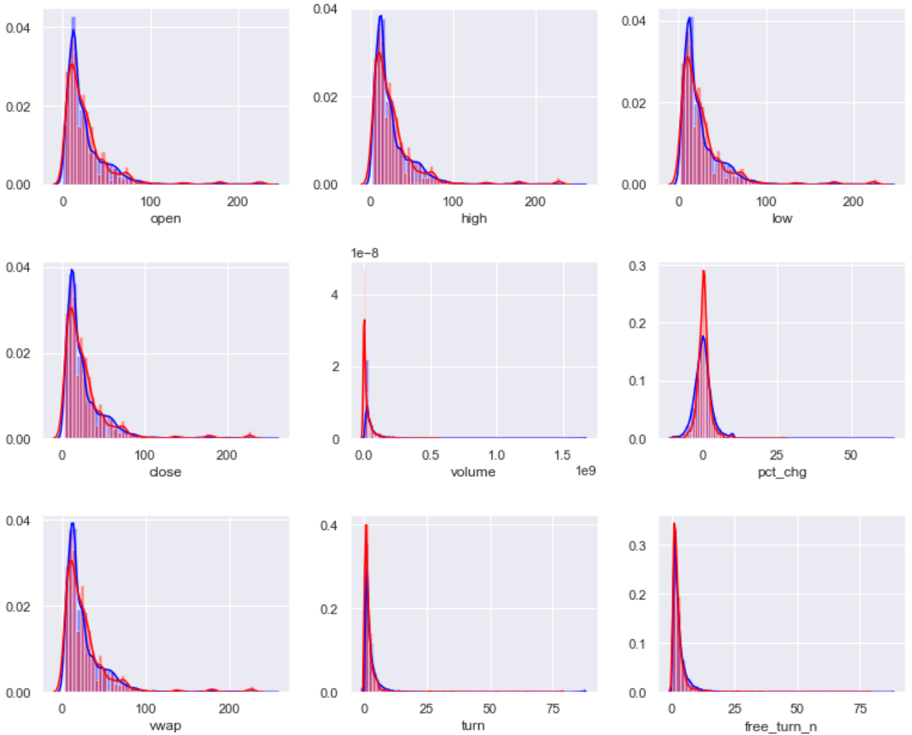
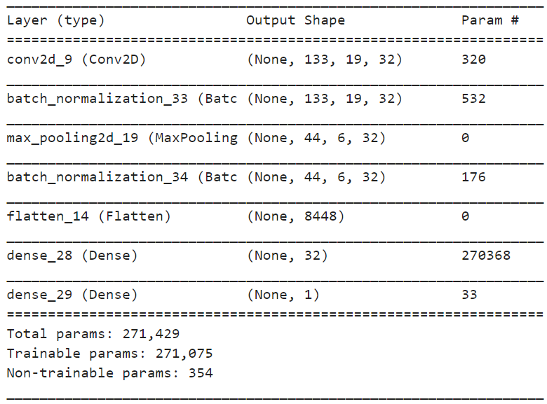
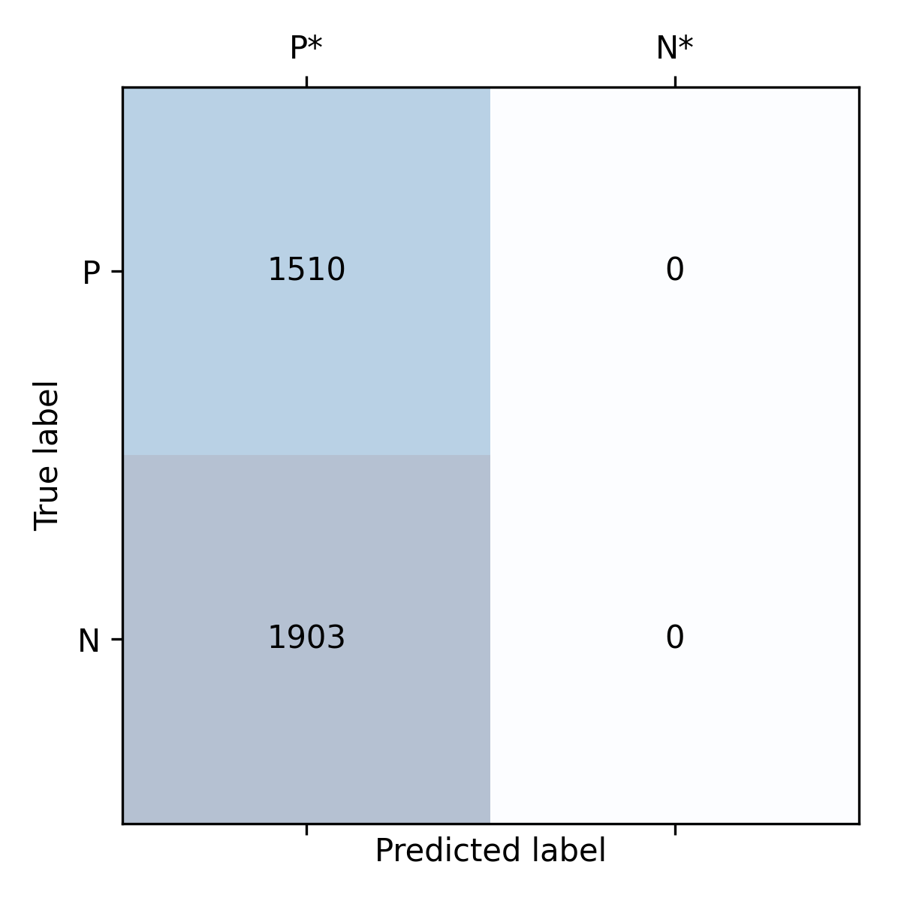
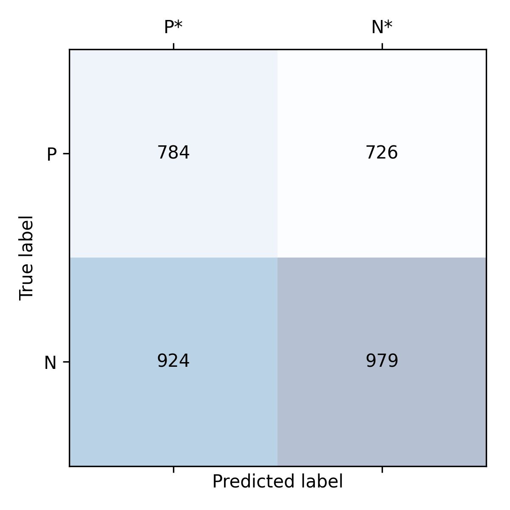

# **Factor mining based on machine learning**

## Team Member

Student Name | Student ID
:---------  | ---------
Li panyu| 2001212358
Li Linxiong| 2001212357

## Project Introduction

In the past 10 years, deep learning models based on neural networks have led the development of artificial intelligence. Different from traditional machine learning, deep learning models directly extract features from raw data and make predictions for targets in an `end-to-end` manner, thereby avoiding manual intervention and information loss in multi-step learning. However, when deep learning is applied to `multi-factor stock selection`, the effect of applying existing models may not meet expectations, and a suitable network structure needs to be tailored.    
In order to integrate the factor generation and multi-factor synthesis steps in multi-factor stock selection, this project designs two types of network structure to `predict the rise or fall` of each stock over the next 10 days: the first is `AlphaNet` using `raw price-volume data` as input, the other is using `price-volume data after feature extraction`, including: CNN, LogisticRegression and Random Forest.

## Data Analysis

### 1. Data Source
* Stock pool: CSI 300 component stocks from 08/10/2010 to 05/11/2021
* Data: volume and price data of individual stocks without feature engineering, transfer the volume and price data into 9*30 `data pictures `, and 30 is the number of historical days
* Labels: rise or fall of each stock over the next 10 days

**Data sample**  

    

    
    

 
### 2. Data processing

* Deal with missing data: open, high, low, close fill with the previous data; volume, pct_chg, vwap, turn, free_turn_n use 0 to fill NAN. After processing, the data has no NAN values. 
* One-hot encoding: One-hot encoder is used to convert categorical data into integer data.
* Feature Standardization：to avoid unit effect, we normalized the data along the feature direction

    

    
    

    
## Model
We devide our data set into training set and validate set. According to datetime, the former 80% belongs to the training set and the rest belongs to validate set. We devide data according to datetime in order to avoid the influence of so called future information.

### 1. Alphanet: use raw price-volume data as input
In order to effectively extract features from the original stock volume and price data, AlphaNet uses the idea of feature construction in genetic programming  and uses a variety of operator functions as a custom network layer for feature extraction. AlphaNet consists of four parts: 
* `Data input`: adopting CNN data format, the original volume and price data of individual stocks are sorted into two-dimensional "data pictures"
* `Feature extraction layer`: the most critical part of AlphaNet, it implemented a variety of custom computing network layers to extract features, and use the Batch Normalization layer for feature standardization.
* `Pooling layer`: consistent with pooling layer in CNN, the characteristics of the upper layer are "blurred".
* `Fully connected layer`: weighted synthesis of extracted features and uses `sigmoid` activation function to make classification

**Network structure**

**Example show the process of feature extraction**  

**Network structure details**  

Layer name | Components | Parameters
:--- | :--- | :---
Feature extraction | ts_corr(X, Y, stride), ts_cov(X, Y, stride), ts_stddev(X, stride), ts_zscore(X, stride), ts_return(X, stride), ts_decaylinear(X, stride), ts_mean(X, stride), BN | stride=10
Pooling layer | ts_mean(X, stride), ts_max(X, stride), ts_min(X, stride), BN | stride=3
Fully Connected Layer | 30 neurons | dropout rate: 0.5, activation function: relu
Output Layer | 1 neurons | activation function: sigmoid
Other params | `Loss function`: Binary_cross_entropy, `Optimizer`: Adam, `Learning rate`: 0.001, `batch_size`: 256

**Toolkit: PyTorch**  
PyTorch is an open source machine learning library and is widely used in deep learning scenarios for its flexibility. PyTorch uses dynamic computational graphs rather than static graphs, which can be regarded as the mean difference between it and other deep learning frameworks.

**Confusion matrix**

### 2. Other models: use the price-volume data after feature extraction as input

#### 2.1 Convolutional Neural Network

Convolutional Neural Network (CNN) is the most influential model in the field of computer vision research and application. The structure of Convolutional Neural Network mimics the working principle of the visual nerve of the eye. The optic nerve is the bridge of the it and the brain, the visual nerve of a lot of collaboration, each responsible for a small parts of the visual image, then the image of different combination of the local feature abstraction to the top of visual concept, make the human has the visual recognition ability Convolution neural network is also similar, includes input layer, hidden layer and output layer. The hidden layer is composed of `convolutional layer, pooling layer and full connection layer`. Feature extraction is carried out by multiple convolution kernels in the local area of the image, and dimension reduction is carried out by pooling layer, and finally feature synthesis is carried out by full connection layer.  
In this project, we build a `CNN with one convolutional layer, one max pooling layer with kernal (3, 3) and two fully connected layer with neurons 32, 1`, respectively.

**Network structure**  

  

**Confusion matrix**  

#### 2.2 LogisticRegression
In order to reduce the time of computing, we use pca method to deduct dimensions. We observed that the 3 most import features can explain almost 90% of all the variance, so we used pca method and set components equal to 3.  
To improve the performance of models, we use GridSearch to find the best C value from [0.01, 0.1, 1, 10, 100].

**Confusion matrix**

#### 2.3 RandomForest
To improve the performance of models, we use GridSearch to find the best max depth from [10, 20, 30, 40] and best max features from [5, 15, 25, 35, 45, 55].

**Confusion matrix**

